# AeOn4.AI | Industrial OT Security Copilot

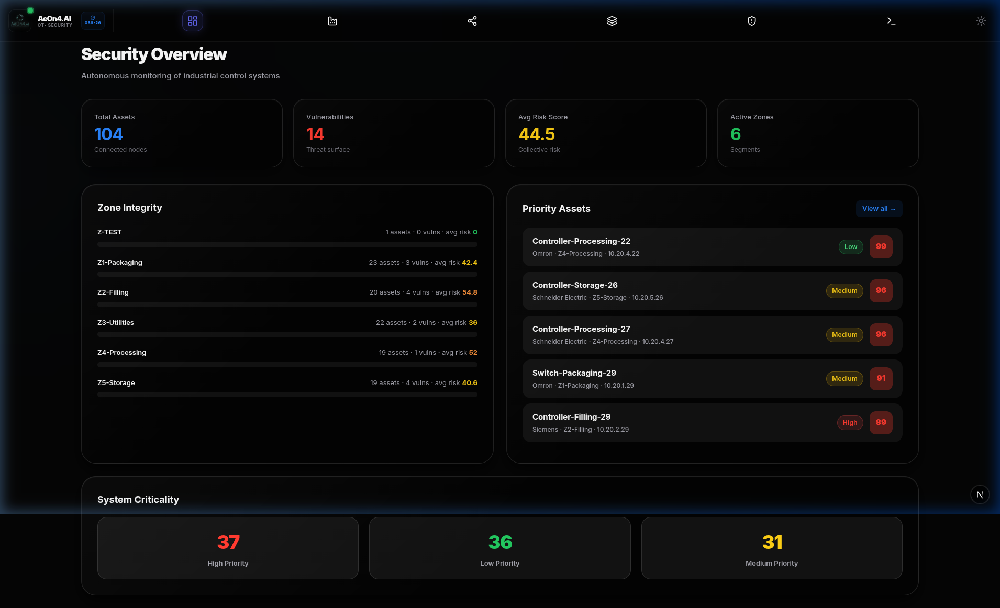

## 🌐 Vision & Purpose
**AeOn4.AI** is a premier Operational Technology (OT) security intelligence platform. Engineered for the complex demands of modern industrial environments, it provides unified visibility, automated risk assessment, and AI-driven insights to secure critical infrastructure and advanced production lines.

---

## 🛠️ Platform Core Capabilities

*   **Semantic Intent Routing**: Deterministic execution via sub-millisecond pattern matching.
*   **Dual-Mode Industrial UI**: Engineered for operational clarity in diverse lighting.
*   **Deep Asset Discovery**: Automated metadata and MAC-based behavioral fingerprinting.
*   **Model Context Protocol (MCP)**: Secure tool execution via `FastMCP`.

---

## 🚀 Getting Started

Follow these steps to deploy the AeOn4.AI platform in your environment.

### 📋 Prerequisites

Before you begin, ensure you have the following installed on your system. If you haven't installed them yet, you can use the commands below (Standard for Linux/Ubuntu):

#### 1. Install Git
```bash
sudo apt update && sudo apt install git -y
```

#### 2. Install Docker & Docker Compose
```bash
curl -fsSL https://get.docker.com -o get-docker.sh && sudo sh get-docker.sh
```

---

### 🛠️ Step-by-Step Installation

#### 1. Clone the Repository
Download the latest version of the AeOn4.AI source code from GitHub:
```bash
git clone https://github.com/jobmathenge/ot-security-mcp-copilot.git
```
> [!NOTE]
> This command creates a local copy of the project including all submodules and assets.

#### 2. Navigate to the Project Directory
Enter the newly created folder to begin configuration:
```bash
cd ot-security-mcp-copilot
```

#### 3. Launch the Platform
Deploy the full stack using Docker Compose. We recommend running a "down" command first to ensure a clean state:

**Clean existing state (Optional but recommended):**
```bash
docker compose down
```
*This stops and removes any existing containers, networks, and images associated with the project.*

**Start the Platform:**
```bash
docker compose up -d
```
*The `-d` flag runs the containers in **detached mode**, allowing the platform to operate in the background.*

---

### ⚡ Quick Start (Single Command)

For experienced users, you can clone and launch the entire platform with a single command:

```bash
git clone https://github.com/jobmathenge/ot-security-mcp-copilot.git && cd ot-security-mcp-copilot && docker compose down && docker compose up -d
```

---

## 🎨 Universal Theme & Device Adaptability

AeOn4.AI follows a **Theme-Aware Responsive Design** philosophy. The platform seamlessly transitions between Light and Dark modes while maintaining pixel-perfect clarity across Desktop, Tablet, and Mobile form factors.

### 4 Theme Comparison (Desktop)
Experience professional aesthetics in any lighting condition.

| Dark Mode | Light Mode |
| :---: | :---: |
|  | 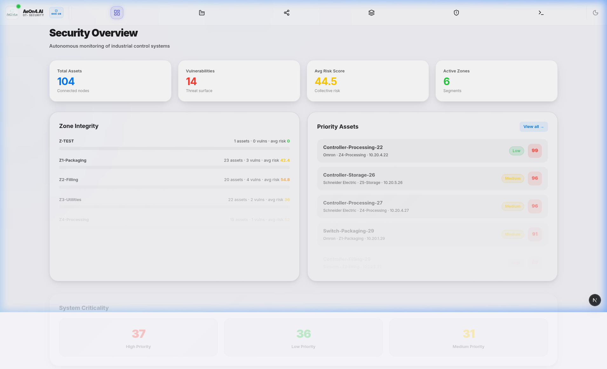 |

---

## 🚀 Intelligent Core Modules

### 1. Mission Control Dashboard
The operational centerpiece of AeOn4.AI. Monitor real-time KPIs, zone integrity, and system criticality through a high-fidelity interface optimized for command centers.

| Desktop | Tablet | Mobile |
| :---: | :---: | :---: |
|  | 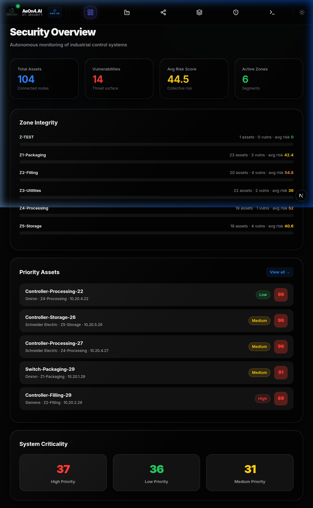 | 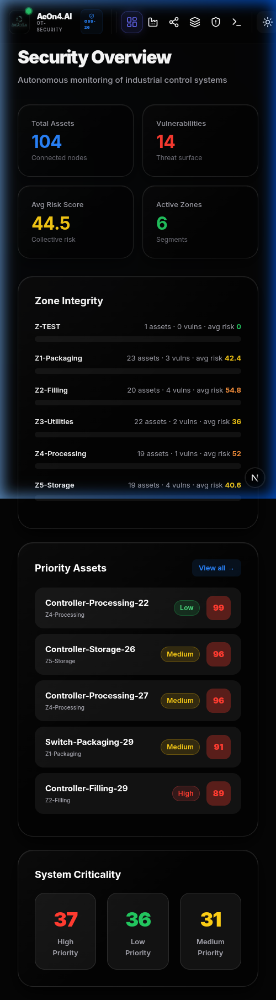 |

### 🏭 Comprehensive OT Asset Management
Inventory management meets deep-dive intelligence. Track every PLC, HMI, and Sensor with automated discovery and granular detail views.

| Theme Comparison | Asset Details View |
| :---: | :---: |
| 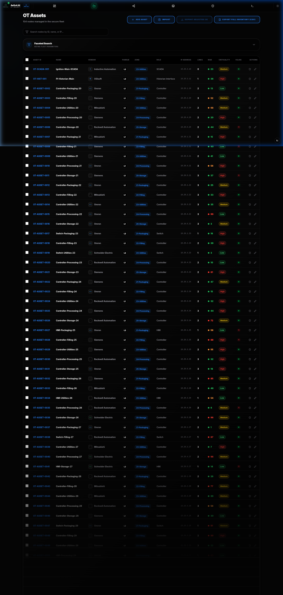 | 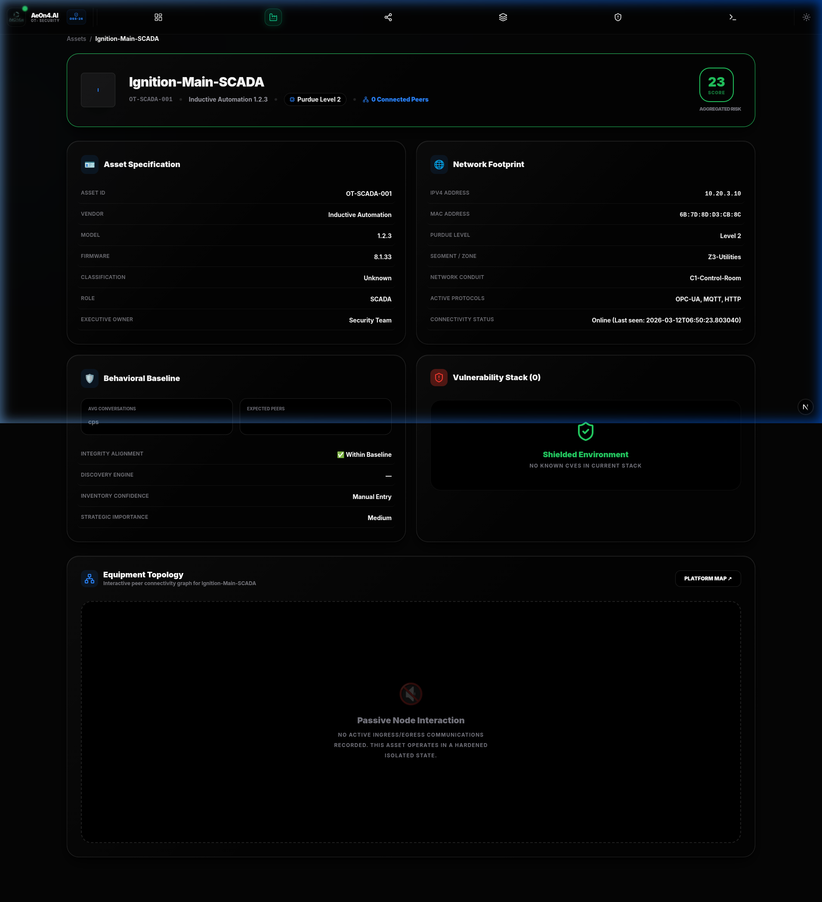 |
| *Dark Mode Inventory* | *Dark Mode Details* |

### ⚠️ Dynamic Risk & Exposure Analysis
Quantify industrial risk through automated vulnerability mapping and prioritised mitigation strategies.

| Perspective | Analysis View |
| :---: | :---: |
| 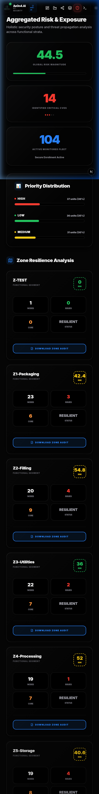 | 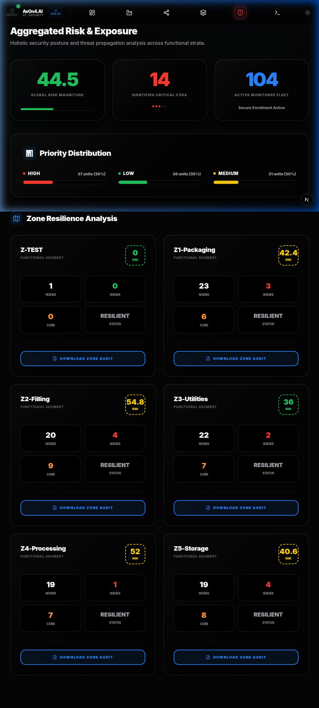 |
| *High-Resolution Analytics* | *Tablet Monitoring* |

### 🕸️ Network Topology & Purdue Stratification
Visualize your industrial perimeter through immersive 3D Force-Directed graphs or the structured Purdue Model (L0-L4) stratification.

| Topology Graph | Purdue Model (Dark) | Purdue Model (Light) |
| :---: | :---: | :---: |
| 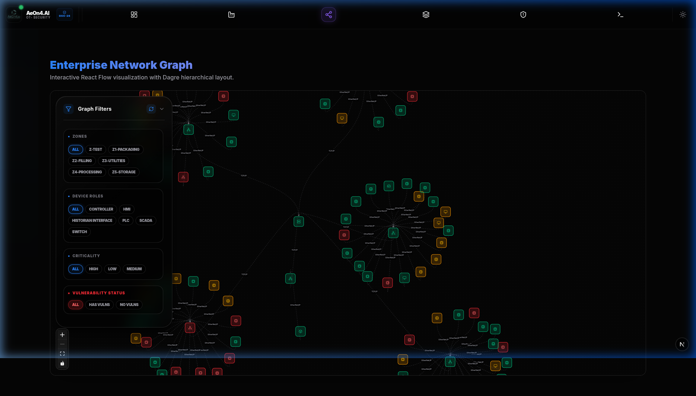 | 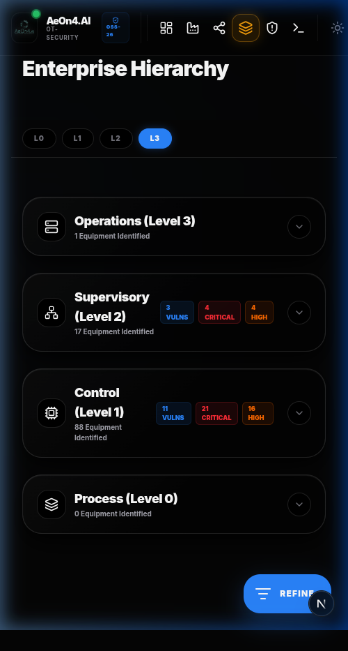 | 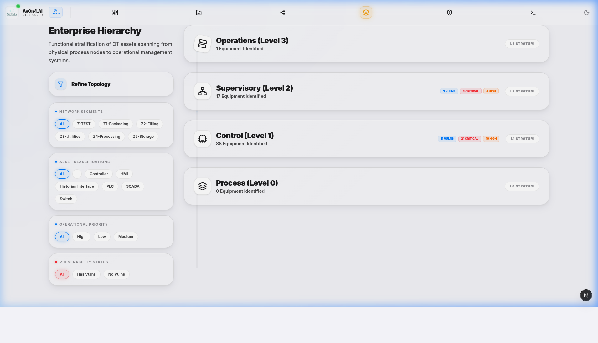 |

### 🤖 AI Copilot (LLM Integrated)
Natural language interaction with your OT environment. Query asset health, isolation protocols, or incident histories instantly.

| Desktop Interaction | Mobile Assistant |
| :---: | :---: |
| 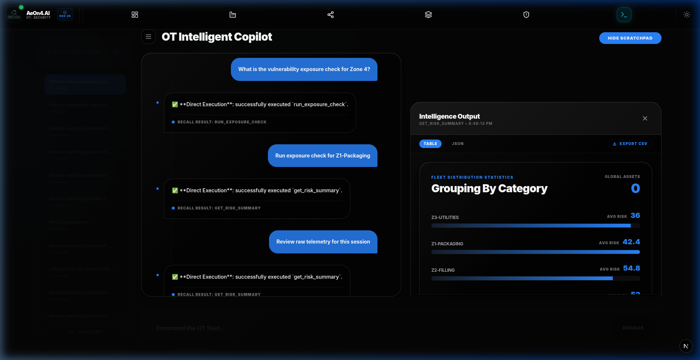 | 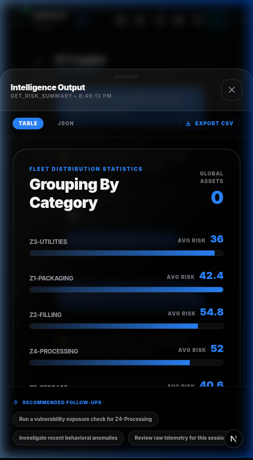 |

---

## 📱 Mobile-First Excellence
AeOn4.AI is a touch-optimized companion for the factory floor.
- **Micro-Interactions**: Optimized for one-handed operation.
- **Priority Alerts**: Critical vulnerabilities surfaced instantly.
- **On-the-go Editing**: Full asset edit capabilities from your mobile device.

| Dashboard | Assets | Details | Edit Flow |
| :---: | :---: | :---: | :---: |
|  | 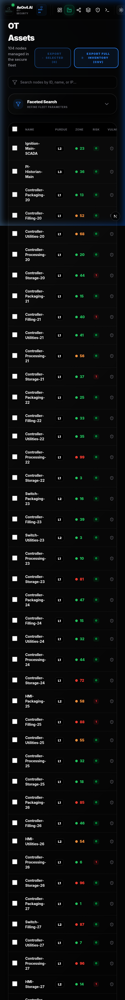 | 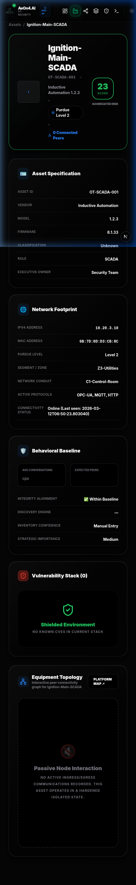 | 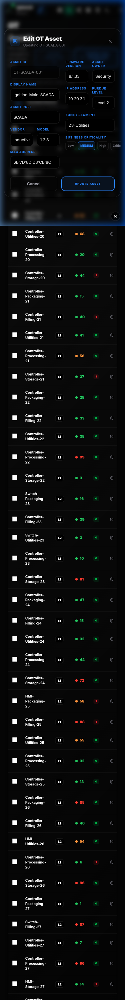 |


## 📜 Licensing & Attribution
- **License**: Apache License 2.0
- **Authorship**: Developed with precision by **JobMathenge** (© 2026).
- **GitHub**: [Official Repository](https://github.com/jobmathenge/ot-security-mcp-copilot)

---
*Securing the next generation of industrial innovation.*
